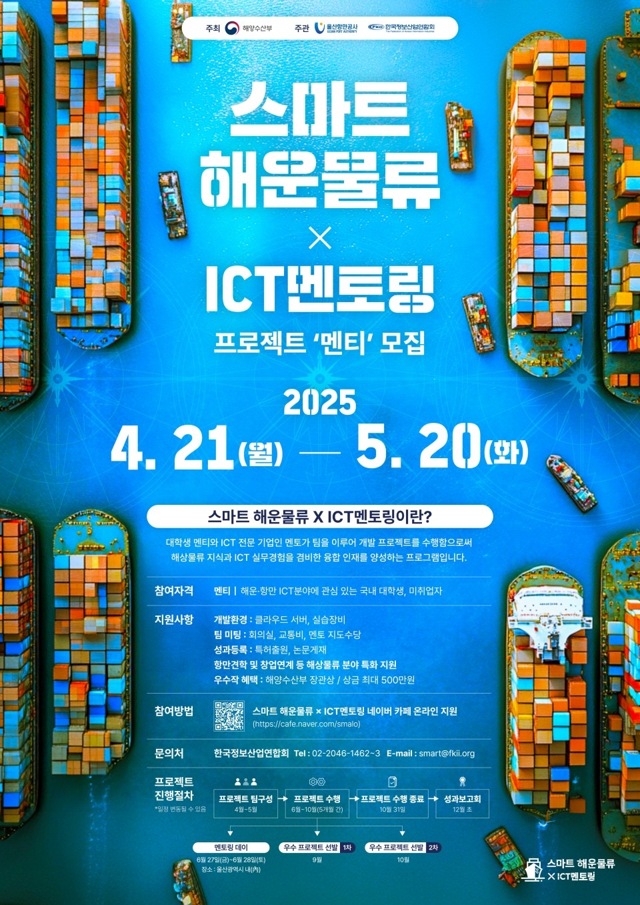

# Port-Hazardous-Substance-Detection-AI-Security-Robot
## 항만 유해물질 탐지 AI 경비로봇

### 멘토, 멘티
- 멘토
  - 박진산
- 멘티 
  - 인천대학교 임베디드시스템공학과 이원종
  - 인천대학교 임베디드시스템공학과 박성국
  - 인천대학교 임베디드시스템공학과 이선우

### 프로젝트 개요
- 항만 현장의 유해물질을 AI로 탐지하고 안전을 강화하는 보안 로봇 프로젝트
- 선우님을 주축으로 활동
- 스마트해운물류 × ICT멘토링 2025 참여 과제로 2025년 7–8월에 수행

### 주요 기능
- 유해물질(NH3/CO/VOCs) 탐지 및 알림
- 실시간 경보 및 로그 기록
- 순찰/이동 및 영상 스트리밍(확장 가능)

### 시연 영상 

### 문서
- 수행계획서

  [2025년 「스마트 해운물류 ICT멘토링」 프로젝트_수행계획서.pdf](doc/2025년%20「스마트%20해운물류%20ICT멘토링」%20프로젝트_수행계획서.pdf)
- 개발보고서

  [「스마트해운물류 × ICT멘토링」 2025 스마트해운물류 우수프로젝트 선발대회_개발보고서.pdf](doc/「스마트해운물류%20×%20ICT멘토링」%202025%20스마트해운물류%20우수프로젝트%20선발대회_개발보고서.pdf)

